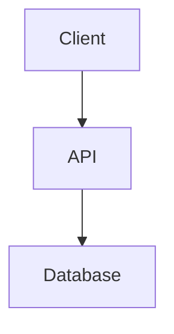

# XeoDocs System Design

System Design and documentation for XeoDocs, including API specifications and backend architecture guides.

## Purpose

This repository serves as a **Source of Truth** for the system design and API specifications. In an AI-assisted development workflow, it provides a centralized, machine-readable, and human-friendly documentation hub.

## Services Overview

This project provides multiple services for previewing and documenting the XeoDocs system:

- **Starlight Documentation Site**: Comprehensive guides and documentation about the backend architecture, design principles, workflows, and component details.
- **Spec Server**: Serves raw OpenAPI YAML specifications.
- **Swagger UI**: Interactive API documentation with testing capabilities.
- **Redoc**: Clean, responsive API documentation viewer.

## Preview with Docker

For a containerized preview environment with hot reload:

(Optional) Customize the ports in `docker-compose.yml` to match your local environment.

To start the containers:

```bash
docker compose up --build -d
```

Available URLs:
- **Starlight Docs (explained docs)**: `http://localhost:12000`
- **Raw OpenAPI YAML file**: `http://localhost:12001/api-spec.yml`
- **Swagger UI (interactive)**: `http://localhost:12002`
- **Redoc (clean, responsive)**: `http://localhost:12003`

To stop the containers and related volumes and images:

```bash
docker compose down --volumes --rmi local
```

## Contributing

### Documentation Content (`docs/`)
Place the Markdown files in the `docs/` directory. Starlight supports standard Markdown and MDX. You can organize files into subdirectories to create sidebar sections.

Example `docs/system-design/01-overview.md`:
````markdown
---
title: Overview
description: System architecture overview
---

## Architecture Diagram


````

### OpenAPI Specification (`openapi/`)
Place the `api-spec.yml` (or `.json`) in the `openapi/` directory. This file will be served by the Raw Spec Server and visualized by Swagger UI and Redoc.

### Starlight Configuration (`starlight.config.mjs`)
Use this file to customize the look and feel of the documentation site, including the sidebar, title, and social links.

Example `starlight.config.mjs`:
```javascript
export default {
    title: 'Project Docs',
    social: [{ icon: 'github', label: 'GitHub', href: 'https://github.com/my-org/my-repo' }],
    sidebar: [
        {
            label: 'System Design',
            items: [
                // Auto-generate links from the file system, or specify manually
                { label: 'Overview', slug: 'system-design/01-overview' },
            ],
        },
    ],
}
```
